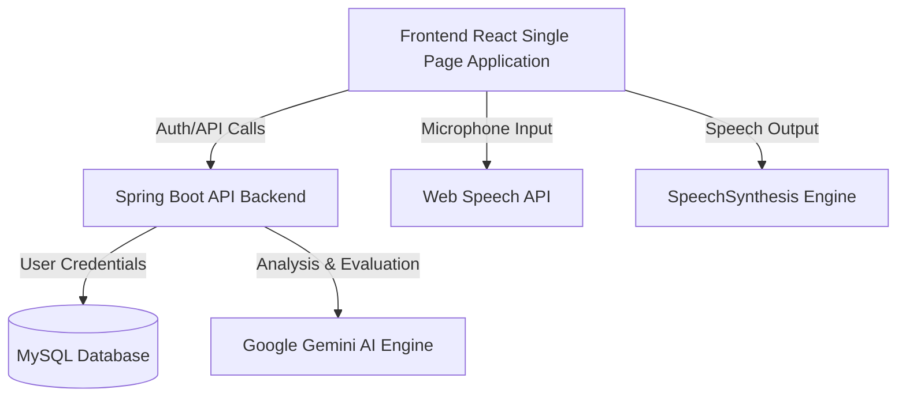

# NexHire AI 🚀

> An advanced, AI-powered mock interview simulation and resume intelligence platform designed to empower candidates to bypass ATS filters, master technical rounds, and land their dream jobs.

NexHire AI leverages **Google Gemini** to deliver realistic, adaptive, and role-specific mock interviews with real-time audio/text interactions and granular, actionable feedback. Additionally, it offers deep resume parsing and analysis to detect ATS compatibility, scan for critical keyword gaps, and provide structural recommendations.

---

## 🌟 Key Features

### 🎙️ AI Mock Interview Room
- **Adaptive Question Generation**: The interviewer adjusts questions dynamically based on the candidate's previous responses, simulating a real-world technical grill.
- **Voice & Text Modes**: Practice using voice input (Web Speech API) and hear response synthesis (SpeechSynthesis) or switch to text-only mode at any time.
- **Tailored Parameters**: Select your target job profile (e.g., Java Backend Developer, System Design, DevOps) and experience level (Beginner, Intermediate, Advanced).
- **In-Depth Performance Report**: Receive a question-by-question breakdown, overall score, identified weaknesses, and a step-by-step remediation guide.

### 📄 Intelligent Resume Analyzer
- **ATS Compatibility Scoring**: Instantly scan your resume PDF and calculate a matching score against standard recruitment algorithms.
- **Keyword Gap Analysis**: Highlights missing industry-standard keywords and libraries relevant to your targeted roles.
- **Formatting & Structural Audits**: Suggests improvements to layout, sentence styling, and action-verb optimizations.

### 📊 Performance Analytics & Dashboard
- **Personalized Metrics**: Track your interview readiness and resume scores over time using interactive data charts (powered by Recharts).
- **Historical Analysis**: Review historical interview transcripts, questions, answers, and detailed evaluation scores.

### 🛡️ Secure Authentication & User Control
- **OAuth 2.0 Integration**: One-click Google Sign-in alongside traditional email authentication.
- **Role-Based Routing**: Strict route guards separating standard Candidates from System Administrators.

### ⚙️ Comprehensive Admin Dashboard
- **Prompt Engineering Studio**: Create, edit, and optimize system instructions and interview behavior on the fly.
- **Audit Logs & Metrics**: Monitor active users, session durations, system logs, and Gemini API request counts.

---

## 🏗️ Architecture & Flow



---

## 🛠️ Tech Stack

| Component | Technology | Description |
| :--- | :--- | :--- |
| **Frontend** | React 19, Vite | Fast, responsive single-page application framework. |
| | Tailwind CSS v4, Framer Motion | Sleek, glassmorphic UI elements and high-performance micro-animations. |
| | Zustand | High-performance, lightweight state management. |
| | Recharts, Lucide Icons | Responsive dashboard graphics and intuitive visual style. |
| **Backend** | Java, Spring Boot | Restful API microservices layer. |
| | Spring Security, JWT | Token-based authentication and secure session management. |
| | Gemini SDK | Custom integrations for prompt engineering and adaptive evaluation. |
| **Database** | MySQL 8.0 | Relational database hosting user profiles, analytics, prompts, and logs. |
| **DevOps** | Docker, Nginx, Compose | Containerization, reverse proxying, and single-command deployment. |

---

## 📂 Project Structure

```bash
Prep-AI/                  # Frontend SPA
├── public/               # Static assets & public files
├── src/
│   ├── assets/           # UI media assets
│   ├── components/       # Reusable components (Header, Sidebar, Route Guards)
│   ├── pages/            # Core views (Dashboard, Resumes, InterviewRoom, LandingPage)
│   ├── services/         # Axios API interceptor configurations
│   ├── store/            # Zustand global state (AuthStore)
│   └── main.jsx          # Application entry point
├── Dockerfile            # Frontend production multi-stage build script
├── docker-compose.yml    # Combined multi-container production configuration
├── tailwind.config.js    # Styling design tokens
└── vite.config.js        # Vite bundling adjustments
```

---

## 🚀 Getting Started

### Prerequisites
- Node.js (v18+) & npm
- JDK 17+ (for backend compilation)
- MySQL 8.0 instance
- Google Gemini API Key

### 📦 Local Frontend Development
1. Clone the repository and navigate to the folder:
   ```bash
   git clone https://github.com/Meraj076/Stress-Prediction-Java-.git
   cd Stress-Prediction-Java-
   ```
2. Install dependencies:
   ```bash
   npm install
   ```
3. Set up environment configurations:
   Create a `.env` file in the root directory:
   ```env
   VITE_GOOGLE_CLIENT_ID=your-google-oauth-client-id
   ```
4. Start the local server:
   ```bash
   npm run dev
   ```
   *The frontend will run at `http://localhost:5173`.*

### ☕ Local Backend Setup
1. Open the backend project directory (usually nested in `../webapplication` or configured alongside the repo).
2. Configure `application.properties` (or set environment variables):
   ```properties
   spring.datasource.url=jdbc:mysql://localhost:3306/webapplication?createDatabaseIfNotExist=true
   spring.datasource.username=your-db-username
   spring.datasource.password=your-db-password
   gemini.api.key=your-gemini-api-key
   ```
3. Launch the Spring Boot application.
   *The backend server will run on port `8081`.*

### 🐳 Deploying with Docker Compose
To run the full stack (Frontend, Backend, and MySQL database) in isolated containers:
1. Ensure Docker Desktop is running.
2. Deploy using Docker Compose:
   ```bash
   docker-compose up -d --build
   ```
3. Access the services:
   - **Frontend App**: `http://localhost:5173`
   - **Backend API**: `http://localhost:8081`
   - **MySQL Database**: `localhost:3306`

---

## 🔒 Environment Variable Summary

| Variable | Description | Location |
| :--- | :--- | :--- |
| `VITE_GOOGLE_CLIENT_ID` | Client ID for Google OAuth | Frontend `.env` |
| `SPRING_DATASOURCE_URL` | JDBC Connection URL to MySQL | Backend Configuration |
| `SPRING_DATASOURCE_USERNAME` | Database username | Backend Configuration |
| `SPRING_DATASOURCE_PASSWORD` | Database password | Backend Configuration |
| `GEMINI_API_KEY` | API Key for accessing Gemini endpoints | Backend Configuration |

---

## 📄 License
This project is licensed under the MIT License. See the [LICENSE](LICENSE) file for more information.

